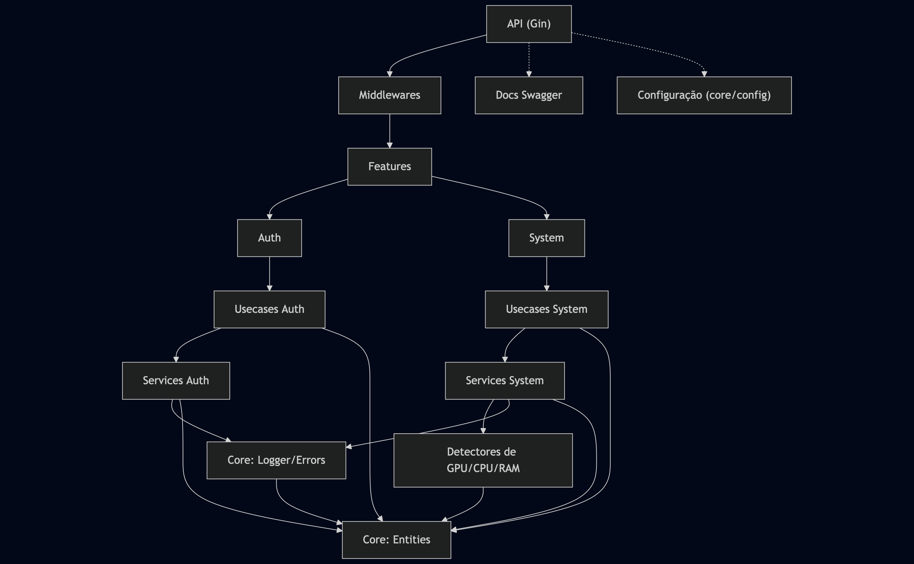

# MicroDetect API

[](https://golang.org)
[](LICENSE)
[](https://github.com/RodolfoBonis/microdetect-api/actions)
[](https://hub.docker.com/)
[](http://localhost:8000/docs/index.html)

## Descrição Geral

A **MicroDetect API** é uma solução robusta para detecção de microorganismos, gerenciamento de datasets, imagens e anotações, com suporte a busca e otimização de hiperparâmetros para modelos de visão computacional (YOLO). O sistema permite upload, organização e anotação automática/manual de imagens, além de monitoramento de recursos e atividades recentes.

---

## Principais Funcionalidades

- **Gerenciamento de Datasets:** Criação, listagem, organização de classes e estatísticas.
- **Upload e Consulta de Imagens:** Upload em lote, organização por dataset, busca e filtragem.
- **Anotação de Imagens:** Suporte a anotação manual e automática (visão computacional).
- **Busca e Otimização de Hiperparâmetros:** Integração com pipelines de busca para modelos de detecção.
- **Monitoramento de Recursos:** CPU, RAM, GPU (NVIDIA CUDA, Apple Silicon MPS), progresso de tarefas.
- **Registro de Atividades Recentes:** Log e consulta de eventos e operações do sistema.
- **Compatibilidade com Diferentes Dispositivos:** CPU, GPU NVIDIA (CUDA), Apple Silicon (MPS).

---

## Principais Endpoints (Exemplos)

| Endpoint                        | Descrição                                      |
|----------------------------------|------------------------------------------------|
| `POST /api/v1/datasets/`        | Criar novo dataset                             |
| `GET /api/v1/datasets/`         | Listar datasets                                |
| `POST /api/v1/images/`          | Upload de imagens                              |
| `GET /api/v1/images/`           | Consultar imagens                              |
| `POST /api/v1/annotations/`     | Anotar imagens (manual ou automática)          |
| `GET /api/v1/system/devices`    | Listar dispositivos disponíveis                |
| `POST /api/v1/hyperparams/search` | Iniciar busca de hiperparâmetros              |
| `WS /ws/monitor`                | WebSocket para monitoramento em tempo real     |

---

## Fluxo de Uso Sugerido

1. **Criar e configurar datasets**
2. **Fazer upload de imagens** e associar a datasets
3. **Anotar imagens** manualmente ou via anotação automática
4. **Iniciar busca de hiperparâmetros** para treinar modelos
5. **Monitorar progresso e métricas** via API ou WebSocket
6. **Consultar atividades recentes** e estatísticas do sistema

---

## Requisitos Gerais

- **Go 1.20+**
- **CUDA Toolkit** (opcional, para uso de GPU NVIDIA)
- **Xcode Command Line Tools** (para Apple Silicon, se necessário)
- **Docker** (opcional, para ambiente isolado)
- **PostgreSQL** (ou outro banco suportado)

---

## Estrutura de Diretórios

```
microdetect-api/
├── app/                # Inicialização e configuração principal
├── core/               # Camada central: logger, errors, middlewares, config
├── features/           # Domínio de negócio (auth, system, datasets, images, etc)
│   ├── auth/           # Autenticação e autorização
│   ├── system/         # Monitoramento de recursos e status do sistema
│   └── ...             # Outros módulos de negócio
├── routes/             # Definição das rotas da API
├── docs/               # Documentação Swagger/OpenAPI
├── dockerfile          # Dockerfile para build da aplicação
├── docker-compose.yaml # Orquestração de serviços (DB, API, etc)
├── go.mod / go.sum     # Dependências Go
└── README.md           # Este arquivo
```

---

## Arquitetura da Aplicação

   

---

## Exemplos de Uso dos Endpoints

### Criar Dataset
```bash
curl -X POST http://localhost:8000/api/v1/datasets/ -d '{"name": "bactérias"}'
```

### Upload de Imagem
```bash
curl -X POST http://localhost:8000/api/v1/images/ -F "file=@/caminho/para/imagem.jpg"
```

### Anotação Automática
```bash
curl -X POST http://localhost:8000/api/v1/annotations/auto -d '{"image_id": 123}'
```

### Monitoramento de Sistema
```bash
curl http://localhost:8000/api/v1/system/devices
```

---

## Como Rodar Localmente

1. **Clone o repositório:**
   ```bash
   git clone https://github.com/seu-usuario/microdetect-api.git
   cd microdetect-api
   ```

2. **Configure as variáveis de ambiente:**
   - Copie `.env.example` para `.env` e ajuste conforme necessário.

3. **Suba os serviços (opcional com Docker):**
   ```bash
   docker-compose up --build
   ```

4. **Ou rode localmente:**
   ```bash
   go run main.go
   ```

---

## Como Rodar Scripts Utilitários

- **Anotação automática:**  
  Execute via endpoint ou script CLI (ver documentação dos scripts em `/scripts`).

---

## Como Configurar Variáveis de Ambiente

Exemplo de `.env`:
```
PORT=8000
DB_HOST=localhost
DB_PORT=5432
DB_USER=usuario
DB_SECRET=senha
DB_NAME=microdetect
ENV=development
CLIENT_ID=...
CLIENT_SECRET=...
REALM=...
KEYCLOAK_HOST=...
```

---

## Licença

Este projeto está sob a licença MIT.  
Veja o arquivo [LICENSE](LICENSE) para mais detalhes.

---

## Contato

- **Autor:** Rodolfo de Bonis
- **Email:** dev@rodolfodebonis.com.br
- **LinkedIn:** https://www.linkedin.com/in/rodolfo-de-bonis/
